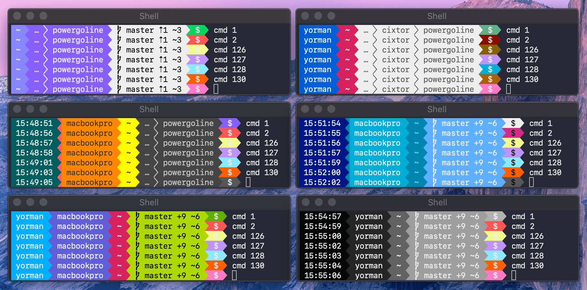

# Powergoline

A lightweight status line for your terminal emulator. This project aims to be a lightweight alternative for [powerline](https://github.com/powerline/powerline) a popular statusline plugin for VIm that statuslines and prompts for several other applications, including zsh, bash, tmux, IPython, Awesome and Qtile.

## Installation

1. Install a patched monospace font [from here](https://github.com/powerline/fonts)
1. `go get -u github.com/cixtor/powergoline`
1. Test using this command: `command powergoline`
1. Add this function to your `.bashrc` configuration

```sh
function set_prompt_command() {
  RESULT=$(powergoline -cwd.n=3 -status.code="$?")
  export PS1="$RESULT"
}
export PROMPT_COMMAND="set_prompt_command; $PROMPT_COMMAND"
```



## Configuration

Use `powergoline -h` to see all available options.

Update the `set_prompt_command` function to add or remove flags accordingly. 

Some color schemes to colorize the prompt are available in the [themes](https://github.com/cixtor/powergoline/tree/master/themes) folder.

## Plugins

Add one or more `-plugin="..."` flags to `set_prompt_command`.

Each plugin must execute a command available in `$PATH`.

Background and foreground colors are automatically selected based on the surrouding prompt segments.

Report errors via `/dev/stderr` and stop the program with `exit(1)` in your corresponding language.

# Performance

Average performance with the default features:

```sh
$ hyperfine --shell=none 'powergoline'
Benchmark 1: powergoline
  Time (mean ± σ):       4.3 ms ±   0.8 ms    [User: 1.4 ms, System: 1.3 ms]
  Range (min … max):     3.7 ms …  11.9 ms    597 runs
```

Average performance with the most basic features enabled:

```sh
$ hyperfine --shell=none 'powergoline ...'
Benchmark 1: powergoline -time.on -user.on -host.on -cwd.on -cwd.n=3 -status.code=0
  Time (mean ± σ):       4.3 ms ±   0.5 ms    [User: 1.5 ms, System: 1.3 ms]
  Range (min … max):     3.8 ms …   7.1 ms    545 runs
```

Average performance with the plugin system enabled:

```sh
$ hyperfine --shell=none 'powergoline ...'
Benchmark 1: powergoline -time.on -user.on -host.on -cwd.on -cwd.n=3 -plugin="echo hello" -status.code=0
  Time (mean ± σ):       6.8 ms ±   1.0 ms    [User: 2.4 ms, System: 3.1 ms]
  Range (min … max):     5.8 ms …  12.0 ms    261 runs
```

Average performance with the repository feature enabled:

```sh
$ hyperfine --shell=none 'powergoline ...'
Benchmark 1: powergoline -time.on -user.on -host.on -cwd.on -cwd.n=3 -repo.on -status.code=0
  Time (mean ± σ):      16.3 ms ±   2.3 ms    [User: 6.7 ms, System: 7.2 ms]
  Range (min … max):    12.9 ms …  28.1 ms    139 runs
```
